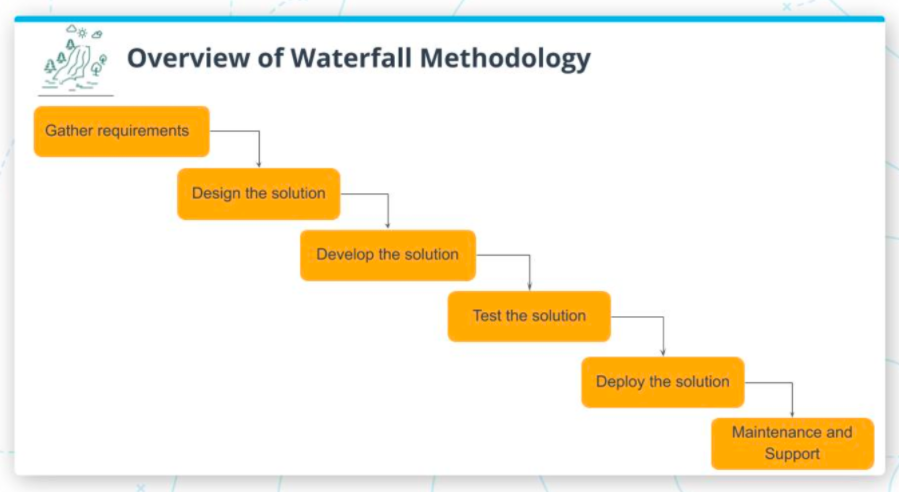

# Table of Contents

a. [Lesson Overview](#Lesson-Overview)  
b. [Waterfall Methodology](#Waterfall-Methodology)  
c. [What is Agile?](#What-is-Agile?)  
d. [Kanban Methodology](#Kanban-Methodology)  
e. [Scrum Methodology](#Scrum-Methodology)  
f. [Exercise: Scrum Methodology](#Exercise:-Scrum-Methodology)  
g. [Work Management Tool](#Work-Management-Tool)  
h. [From Development to Deployment](#From-Development-to-Deployment)  
i. [Lesson Recap](#Lesson-Recap)  
 

# Lesson Overview

Watch [The Lesson Overview.](https://youtu.be/tmmT9NYZQEo)

 

As a Product Manager who has understood the various development methodologies, you will be able to share actionable feedback on what can be improved in the development team's process after following their current process for the initial few weeks.

You will learn how work is structured and managed using work management tools and how do development teams develop new features while maintaining the existing product's stability. These concepts remain largely unchanged even if the issue and project tracking software tools vary by company.

We'll cover a few main methodologies: waterfall, agile, kanban and scrum.

 
 

# Waterfall Methodology

 

What is the Waterfall methodology?

The Waterfall process is divided into distinct phases where `each phase cannot begin unless the previous phase is completed` since it also serves as an input for the next phase. 

 

Let's understand each of these phases better:

`Gather Requirements` : The requirements must be fully captured and defined through rigorous documentation in the form of an elaborate requirements document.

 

`Design the solution` : The requirements are utilized to design the product that details the functional or system requirements and aids in defining engineering architecture. The requirements and solution may be functionality focused instead of being customer-centric.

 

`Develop the solution` : The scope of work is broken into smaller manageable units and developed independently. Each unit of work is tested to confirm whether the intended functionality has been developed - this is called Unit Testing.

 

`Test the solution` : The units developed and verified in the previous phase are combined or integrated. This integrated system is tested thoroughly for any issues or failures.

 

`Deploy the solution` : Once the product has been exhaustively and comprehensively tested, it is deployed to the production environment for customers to start using it.

 

`Maintenance and support` : When issues arise, they are fixed. Enhancements to the product go through the same process to deliver the changes.

 
 

Each phase requires a sign-off from an approver ( for e.g. in the case of Gather Requirements and Design the Solution - it could be the enterprise customer for a B2B2C product) to ensure there is no overlap between phases ( e.g. gather requirements and design the solution).

The waterfall methodology is adopted by the development and product team based on various factors, which make the linear and sequential process a more appropriate approach:

- Requirements are not ambiguous and fixed.
- Ample resources with the expertise required to develop and launch the project are available for a significant amount of time at the project’s disposal
- Project timeline is short

 

In a project, the requirements gathering is in progress and 85% completed. The remaining 15% will take another 2 weeks to complete. Can you kick-off designing the solution for the 85% finalized requirements because it is clear and can’t change?

No - Each phase needs to be completed prior to beginning the next phase.

 
 

# What is Agile?

Understanding the Agile Philosophy

Companies need to respond to change and adapt to evolving customer needs and constantly changing market dynamics. This requires a shift in the development methodology's focus from following rigid processes to focusing on people and how they collaborate.

 

Agile methodology is centered around `the need to respond to change and adapt`. It is an `iterative approach` to software development, where requirements and solutions evolve through constant collaboration and clear communication within the self-organizing cross-functional team. 

A self-organizing team decides how to get things done versus waiting for another person (e.g. project manager) to step in and lead the team to figure out what needs to be done next.

 

Kanban and Scrum are popular frameworks that enable teams to embrace and follow agile principles, and helping teams deliver value faster without compromising quality.

We'll learn more about both in the next sections of the lesson.

 
 

# Kanban Methodology

Watch 

### Further Reading

 
 

# Scrum Methodology

Watch 

### Further Reading

 
 

# Exercise: Scrum Methodology

Watch 

### Further Reading

 
 

# Work Management Tool

Watch 

### Further Reading

 
 

# From Development to Deployment

Watch 

### Further Reading

 
 

# Lesson Recap

Watch 

### Further Reading

 
 