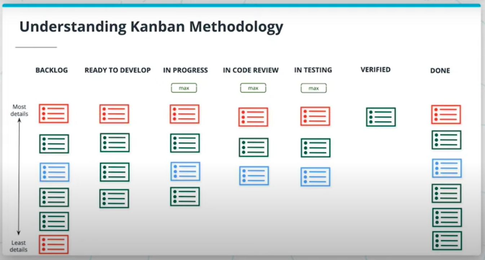
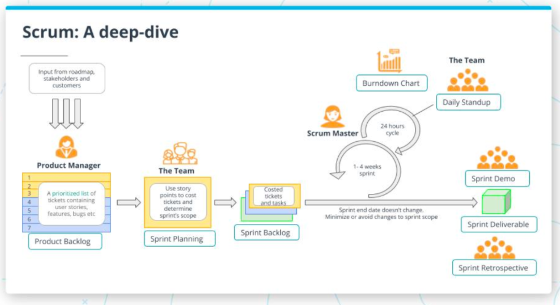
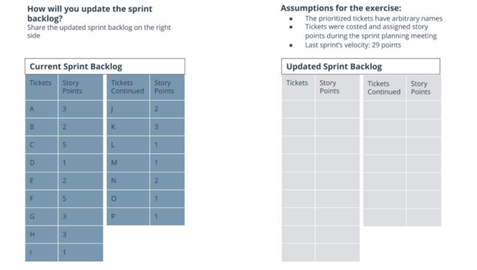
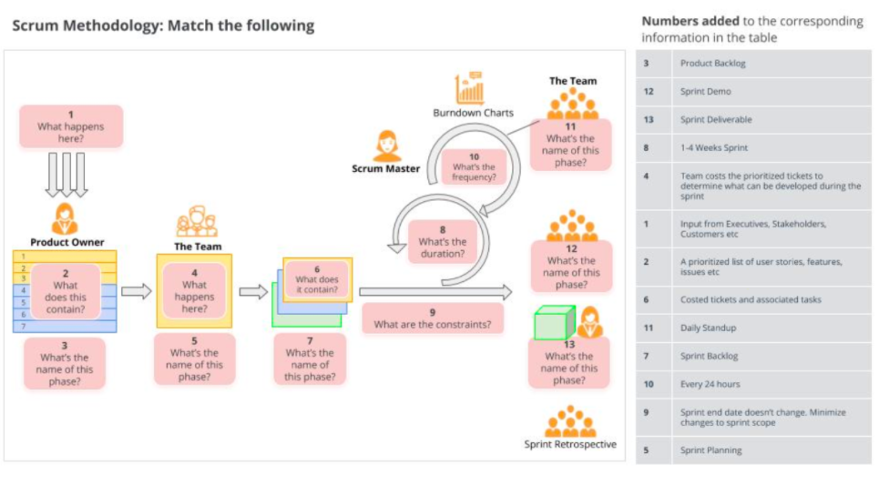
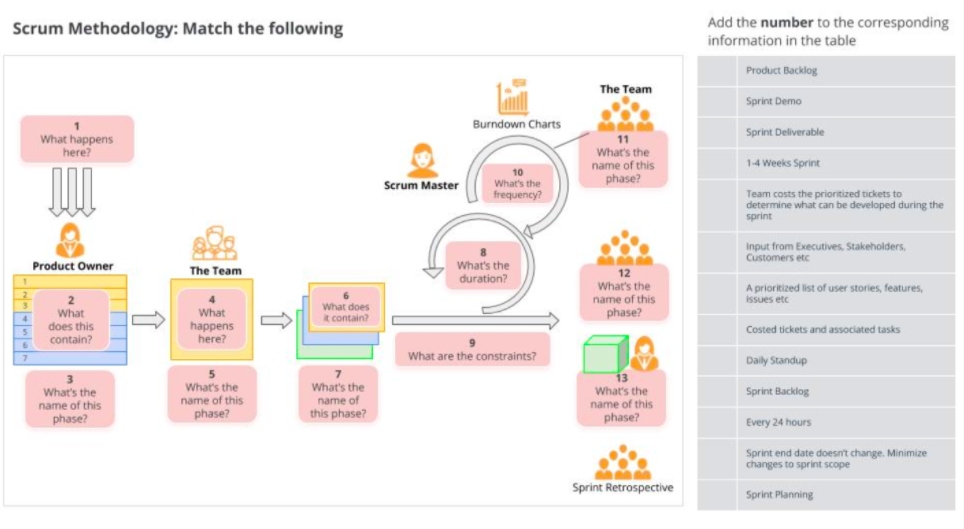
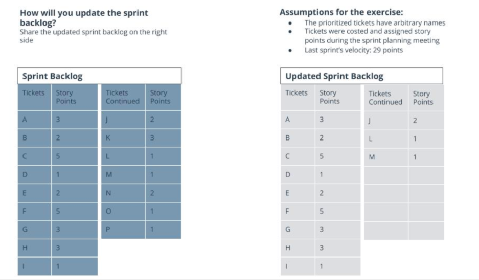

# Table of Contents

a. [Lesson Overview](#Lesson-Overview)  
b. [Waterfall Methodology](#Waterfall-Methodology)  
c. [What is Agile?](#What-is-Agile?)  
d. [Kanban Methodology](#Kanban-Methodology)  
e. [Scrum Methodology](#Scrum-Methodology)  
f. [Exercise: Scrum Methodology](#Exercise:-Scrum-Methodology)  
g. [Work Management Tool](#Work-Management-Tool)  
h. [From Development to Deployment](#From-Development-to-Deployment)  
i. [Lesson Recap](#Lesson-Recap)  
 

# Lesson Overview

Watch [The Lesson Overview.](https://youtu.be/tmmT9NYZQEo)

 

As a Product Manager who has understood the various development methodologies, you will be able to share actionable feedback on what can be improved in the development team's process after following their current process for the initial few weeks.

You will learn how work is structured and managed using work management tools and how do development teams develop new features while maintaining the existing product's stability. These concepts remain largely unchanged even if the issue and project tracking software tools vary by company.

We'll cover a few main methodologies: waterfall, agile, kanban and scrum.

 
 

# Waterfall Methodology

 

What is the Waterfall methodology?

The Waterfall process is divided into distinct phases where `each phase cannot begin unless the previous phase is completed` since it also serves as an input for the next phase. 

 

Let's understand each of these phases better:

`Gather Requirements` : The requirements must be fully captured and defined through rigorous documentation in the form of an elaborate requirements document.

 

`Design the solution` : The requirements are utilized to design the product that details the functional or system requirements and aids in defining engineering architecture. The requirements and solution may be functionality focused instead of being customer-centric.

 

`Develop the solution` : The scope of work is broken into smaller manageable units and developed independently. Each unit of work is tested to confirm whether the intended functionality has been developed - this is called Unit Testing.

 

`Test the solution` : The units developed and verified in the previous phase are combined or integrated. This integrated system is tested thoroughly for any issues or failures.

 

`Deploy the solution` : Once the product has been exhaustively and comprehensively tested, it is deployed to the production environment for customers to start using it.

 

`Maintenance and support` : When issues arise, they are fixed. Enhancements to the product go through the same process to deliver the changes.

 
 

Each phase requires a sign-off from an approver ( for e.g. in the case of Gather Requirements and Design the Solution - it could be the enterprise customer for a B2B2C product) to ensure there is no overlap between phases ( e.g. gather requirements and design the solution).

The waterfall methodology is adopted by the development and product team based on various factors, which make the linear and sequential process a more appropriate approach:

- Requirements are not ambiguous and fixed.
- Ample resources with the expertise required to develop and launch the project are available for a significant amount of time at the project’s disposal
- Project timeline is short

 

In a project, the requirements gathering is in progress and 85% completed. The remaining 15% will take another 2 weeks to complete. Can you kick-off designing the solution for the 85% finalized requirements because it is clear and can’t change?

No - Each phase needs to be completed prior to beginning the next phase.

 
 

# What is Agile?

Understanding the Agile Philosophy

Companies need to respond to change and adapt to evolving customer needs and constantly changing market dynamics. This requires a shift in the development methodology's focus from following rigid processes to focusing on people and how they collaborate.

 

Agile methodology is centered around `the need to respond to change and adapt`. It is an `iterative approach` to software development, where requirements and solutions evolve through constant collaboration and clear communication within the self-organizing cross-functional team. 

A self-organizing team decides how to get things done versus waiting for another person (e.g. project manager) to step in and lead the team to figure out what needs to be done next.

 

Kanban and Scrum are popular frameworks that enable teams to embrace and follow agile principles, and helping teams deliver value faster without compromising quality.

We'll learn more about both in the next sections of the lesson.

 
 

# Kanban Methodology

Watch [What is Kanban?](https://youtu.be/RUJzFg9kYbc)

 

With increased product complexity and distributed teams, it's difficult to avoid bottlenecks during development and delivery.

When one portion of work is done, like a developer's ticket, it needs to be reviewed by that team, to ensure it matches their standards, best practices and guidelines. We need to know that it doesn't conflict with existing features.

It's not uncommon for tickets to be stuck during this review phase because either the feedback isn't given quickly or the feedback isn't implemented. This process happens several times during the development of each part of the product.

If the review takes days, this can be a bottleneck.

 

Kanban utilizes the power of visualization to increase team efficiency and deliver value to the customer faster.

 

It enables a highly motivated team to `visualize the progress of their work` and the process through which the project has to flow through.

Kanban enforces a maximum number of items that can be in a particular stage of the process. Work In Progress (WIP) limits help avoid bottlenecks.

By helping the team see that clearly, Kanban methodology enables the team to swarm and figure out how to unblock the team.

The team focuses on taking the work from start to finish as fast as possible, which is called cycle time. This improves throughput by reducing cycle time.

 
 

### Kanban Board

Watch [What is Kanban? Part II](https://youtu.be/P8RHkmGIN0c)

_Note: In the video, the instructor defined lead time as the time taken to move an item from Ready-to-Develop to Done. It should be the time taken to move an item from Backlog to Done._

 

 

Let's go through the columns of a typical Kanban Board to understand each step of the process. 

These columns are filled with tickets (or cards) which are items on the to-do list, or a feature requirement. They have a topic/title and details.

 

`The Backlog:` This first step indicates the work that needs to be completed by the development team. 

It's managed by the product manager, in a prioritized order. The most urgent is at the top with the most details. As you descend the list, the amount of details and priority is reduced.

The least detailed tickets capture the context or scope of the ticket at a high level. You can add details later.

 

`Ready To Develop:` Backlogged tickets still need to be reviewed and updated before going into development. Sometimes the details change or new input from stakeholders and designers will affect the ticket.

It's the PMs job to update the ticket with the most up-to-date information, then move it into the Ready-To-Develop column, to indicate to the developers what to work on next.

This column is again ordered from top to bottom by most to least urgent.

 

`In Progress:` Once a developer picks a ticket from the Ready-To-Develop column, they'll move it to the In-Progress column.

To eliminate bottlenecks, the engineering team determines the maximum number of tickets that can be in this column at any time.

This is the `Work In Progress Limit` (WIP).

 

`In Code Review:` When a developer has finished the ticket and is ready for their engineering team to review it, an engineer moves their ticket to "In Code Review".

This column will also have a WIP limit to avoid bottlenecks. By placing this limit, it forces the team to swarm to reduce the number of tickets in this column before they can continue taking on new tasks.

 

`In Testing:` Once a ticket has been reviewed and approved, it's ready for testing. The WIP limit here is determined by the QA team's availability.

Once the QA team verifies the ticket, you will also step in to verify the feature is correct as well. This is called `User Acceptance Testing` or `Feature Sign-Off`.

The PM must verify that the work has been completed and meets the product requirements.

 

`Verified:` This column displays the work that has been verified by Engineering, QA and Product teams, and is ready to be released to customers.

 

`Done:` This last column indicates which tickets have been successfully deployed to customers and are "live".

 
 

### Lead time vs. Cycle time

`Cycle time` refers to the time a ticket takes to go from the Ready to Develop stage to being Done. 

`Lead time`, on the other hand, is the time taken to take the ticket from Backlog to Done.

 

The team will calculate the Lead Time based on the amount of time it takes for an item to actually move from Backlog to Done.

We can think of the difference between Lead and Cycle time as the difference between customer and internal perspectives.

Lead time measures how long it takes from order to delivery -- what your customer sees happening.

Cycle time measures how long it takes from the actual developer work starting to delivery -- what you internal development team experiences.

 

You'd calculate Lead Time by measuring how long it takes a ticket to go from a "Requested" state to "Done".

Cycle Time is measured by the moment new tickets go from "In Progress" to "Done".

 
 

True or False: Lead time is the time taken to move a ticket (scope of work) from the backlog managed by Product Manager to finish, where the value is deployed to customers.

True! Lead time is time taken to move the ticket from ready to develop to finish, where it is deployed to customers.

 

### Further Reading

[Kanban Defined](https://www.agilealliance.org/glossary/kanban/#)

[Kanban, according to Atlassian](https://www.atlassian.com/agile/kanban)

[Measuring Lead v Cycle Time](https://kanbanize.com/kanban-resources/kanban-software/kanban-lead-cycle-time)

 
 

# Scrum Methodology

Watch [What is Scrum?](https://youtu.be/88QuwpyH2bU)

Watch [Scrum: Sprint & Roles Defined](https://youtu.be/mqZcP7wSj3U)

 

Scrum enables the team to self organize and work together to develop and maintain complex products.

A clearly defined set of guidelines on roles that need to be played by different team members, what needs to be covered in the meetings, how frequently should the team meet and, who needs to attend these meetings.

Team Dynamics is at the core of the scrum. The guidelines are aimed at creating open communication channels between the development team members and the product manager to gain clarity around what is expected of each other and share project progress.

The emphasis on short release cycles allow the team to adapt to changing requirements and business condition.

 
 

## Sprint Planning

Watch [What is Sprint Planning?](https://youtu.be/7res-_xfHpo)

Watch [The Sprint Planning Meeting](https://youtu.be/kjsgxdoBha8)

 
 

## Daily Standups

Watch [The Daily Standup](https://youtu.be/3sw9t_ZDobI)

Watch [Sprint Deliverables](https://youtu.be/ZxfSBa-yll8)

 

Scrum enables the team to self organize and work together to develop and maintain complex products.

A clearly defined set of guidelines on roles that need to be played by different team members, what needs to be covered in the meetings, how frequently should the team meet and, who needs to attend these meetings.

Team Dynamics is at the core of the scrum. The guidelines are aimed at creating open communication channels between the development team members and the product manager to gain clarity around what is expected of each other and share project progress.

The emphasis on short release cycles allow the team to adapt to changing requirements and business condition.

 
 

# Exercise: Scrum Methodology

 

View the solution image

 

 

View the solution image

 

Describe Scrum, Kanban, and Waterfall methodologies.

| Name | Methodology |
| ---- | ----------- |
| Scrum | An iterative and incremental development process, in which an incremental build is delivered every few (1-4) weeks. |
| Kanban | This methodology focuses on building what matters the most right now using a series of visual workflow boards. |
| Waterfall | A linear sequential approach, where development moves through a series of distinct phases. Each phase must be completed for the next one to begin. |

 

 
 

# Work Management Tool

Watch [What is a Work Management Tool? Part 1](https://youtu.be/FfLCT67IroY)

Watch [What is a Work Management Tool? Part 2](https://youtu.be/zSuTolqI3Vw)

The purpose of a work management tool is to help teams of all types manage work starting from capturing detailed requirements, bugs and issue tracking, and test case management to agile software development. With teams becoming global and adopting an iterative approach to developing software, the need for a single tool that is a central hub for the coding, collaboration, and release stages is critical.

 

Watch [What is a Work Management Tool? Part 3](https://youtu.be/x2lEHDjB540)

Watch [What is a Work Management Tool? Part 4](https://youtu.be/naRiHU5ui8A)

Watch [What is a Work Management Tool? Part 5](https://youtu.be/8Hsl9OX3fGI)

 
 

Describe story, epic, sub-tasks, and product initiative.

| Name | Methodology |
| ---- | ----------- |
| Story | It is written from the user perspective and used to capture the requirements that need to be developed and tested. |
| Epic | It is an independent body of work that can be split into smaller stories and requires few sprints to complete. |
| Sub-tasks | It captures the lowest level of work that needs to be done by the scrum team. |
| Product Initiative | It captures the entire work that needs to be developed to achieve a common goal and may take multiple quarters to complete. |

 
 

# From Development to Deployment

Watch [Development to Deployment: Part 1](https://youtu.be/eGnPkHACjns)

Watch [Development to Deployment: Part 2](https://youtu.be/m8CiYZMrgOc)

Watch [Development to Deployment: Part 3](https://youtu.be/ULAjKoM3h9w)

 

The development team uses a version control system to track all the changes made to the codebase, manage and view the changes made in a specific part of the codebase easily. It also allows the development team to restore the codebase to a stable version when undesirable or unstable changes are added to the code base.

Developers always start with the most current and stable version of codebase called the master or main trunk and make a copy (called as a branch) to their local environment.

 

Once the developer adds new features or makes modifications to an existing feature, they write and execute test cases to ensure their modified code passes. This is called unit testing.

 

When developers merge their unit-test verified code directly, conflicts may occur. Many teams adopt continuous integration, where the modified codebase is validated by running automated tests. This helps the development team identify and resolve conflicts earlier and improve delivery speed

 

Continuous delivery is an extension of continuous integration, where the latest version of the master is deployed automatically to an internal environment called staging.

 

QA team conducts comprehensive and exhaustive manual testing in the staging environment. The product manager conducts user acceptance testing, feature demo and sign-off with internal stakeholders here.
In most companies deployment to production is manual

 

After deploying the latest version of the codebases to production, smoke tests are run to verify whether basic functions and critical features are working as expected

 
 

True or False? Developers can merge their unit-test verified modified code directly to create a new version of the Master.

False - Scrum team runs the developer’s unit-test verified code through automated tests.Upon passing the tests, code is merged to create a new version of the master.

 
 

# Lesson Recap

Watch [The Lesson Recap](https://youtu.be/rOkZ1hTqS7U)

These concepts will help you understand the inner workings of the team faster and better.

- Share actionable feedback on what can be improved in the development team's process after following their current process for the initial few weeks.

- Contribute to development work sooner, since how work is structured and managed and how development teams develop new features remain largely unchanged as a concept

 
 